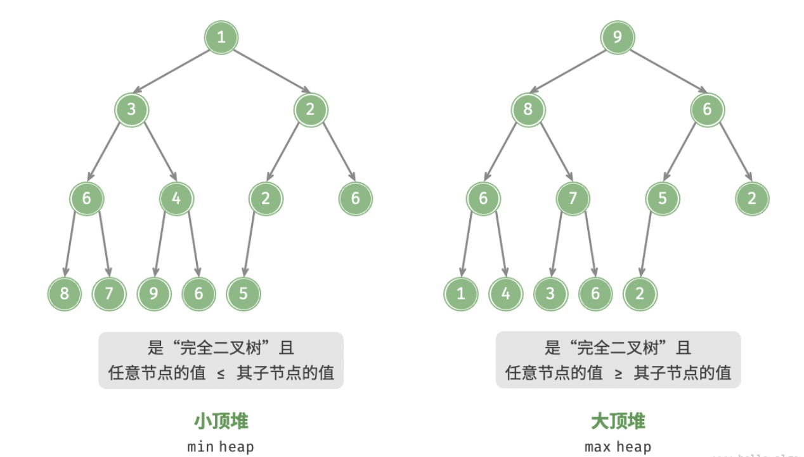
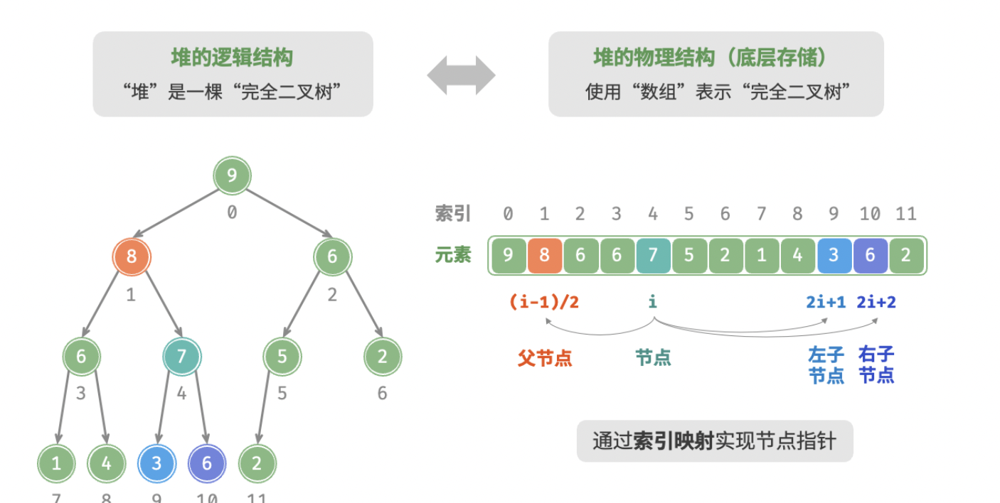

# 堆
「堆 heap」是一种满足特定条件的完全二叉树，主要可分为两种类型
- 「小顶堆 min heap」: 任意节点的值 <= 其子节点的值
- 「大顶堆 max heap」: 任意节点的值 >= 其子节点的值

堆作为完全二叉树的一个特例, 具有以下特性: 
- 最底层节点靠左填充，其他层的节点都被填满
- 我们将二叉树的根节点称为“堆顶”，将底层最靠右的节点称为“堆底”
- 对于大顶堆（小顶堆），堆顶元素（根节点）的值是最大（最小）的

堆通常用于实现优先队列，大顶堆相当于元素按从大到小的顺序出队的优先队列

### 堆的存储与表示
- 完全二叉树非常适合用数组来表示
- 元素代表节点值，索引代表节点在二叉树中的位置
- 给定索引 $i$, 其左子节点的索引为 $2i+1$, 右子节点的索引为 $2i+2$, 父节点的索引为 $Math.floor((i - 1) / 2)$, 当索引越界时，表示空节点或节点不存在

### 访问堆顶元素
- 堆顶元素即为二叉树的根节点: 数组第一个元素

### 元素入堆
给定元素 val ，首先将其添加到堆底。添加之后，由于 val 可能大于堆中其他元素，堆的成立条件可能已被破坏，因此需要修复从插入节点到根节点的路径上的各个节点，这个操作被称为「堆化 heapify」
考虑从入堆节点开始，从底至顶执行堆化。我们比较插入节点与其父节点的值，如果插入节点更大，则将它们交换。然后继续执行此操作，从底至顶修复堆中的各个节点，直至越过根节点或遇到无须交换的节点时结束

=== "<1>"
    

=== "<2>"
    

=== "<3>"
    

=== "<4>"
    

=== "<5>"
    

=== "<6>"
    

=== "<7>"
    

=== "<8>"
    

=== "<9>"
    

设节点总数为 $n$ ，则树的高度为 $O(\log n)$ 。由此可知，堆化操作的循环轮数最多为 $O(\log n)$ ，**元素入堆操作的时间复杂度为 $O(\log n)$** 

### 堆顶元素出堆
堆顶元素是二叉树的根节点，即列表首元素。如果我们直接从列表中删除首元素，那么二叉树中所有节点的索引都会发生变化，这将使得后续使用堆化进行修复变得困难。为了尽量减少元素索引的变动，我们采用以下操作步骤。

1. 交换堆顶元素与堆底元素（交换根节点与最右叶节点）。
2. 交换完成后，将堆底从列表中删除（注意，由于已经交换，因此实际上删除的是原来的堆顶元素）。
3. 从根节点开始，**从顶至底执行堆化**。

如下图所示，**“从顶至底堆化”的操作方向与“从底至顶堆化”相反**，我们将根节点的值与其两个子节点的值进行比较，将最大的子节点与根节点交换。然后循环执行此操作，直到越过叶节点或遇到无须交换的节点时结束。

=== "<1>"
    

=== "<2>"
    

=== "<3>"
    

=== "<4>"
    

=== "<5>"
    

=== "<6>"
    

=== "<7>"
    

=== "<8>"
    

=== "<9>"
    

=== "<10>"
    

与元素入堆操作相似，堆顶元素出堆操作的时间复杂度也为 $O(\log n)$ 

### 堆的常见应用
- **优先队列**：堆通常作为实现优先队列的首选数据结构，其入队和出队操作的时间复杂度均为 $O(\log n)$ ，而建队操作为 $O(n)$ ，这些操作都非常高效。
- **堆排序**：给定一组数据，我们可以用它们建立一个堆，然后不断地执行元素出堆操作，从而得到有序数据。然而，我们通常会使用一种更优雅的方式实现堆排序，详见“堆排序”章节。
- **获取最大的 $k$ 个元素**：这是一个经典的算法问题，同时也是一种典型应用，例如选择热度前 10 的新闻作为微博热搜，选取销量前 10 的商品等。

# 建堆操作

### 借助入堆操作实现

我们首先创建一个空堆，然后遍历列表，依次对每个元素执行“入堆操作”，即先将元素添加至堆的尾部，再对该元素执行“从底至顶”堆化。
每当一个元素入堆，堆的长度就加一。由于节点是从顶到底依次被添加进二叉树的，因此堆是“自上而下”构建的。
设元素数量为 $n$ ，每个元素的入堆操作使用 $O(\log{n})$ 时间，因此该建堆方法的时间复杂度为 $O(n \log n)$ 。

### 通过遍历堆化实现

实际上，我们可以实现一种更为高效的建堆方法，共分为两步。

1. 将列表所有元素原封不动地添加到堆中，此时堆的性质尚未得到满足。
2. 倒序遍历堆（层序遍历的倒序），依次对每个非叶节点执行“从顶至底堆化”。

